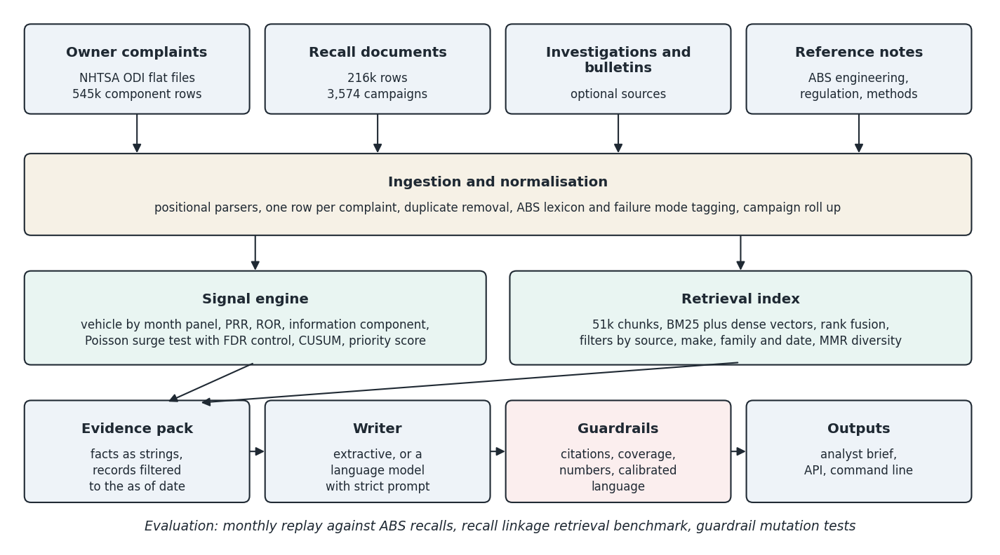
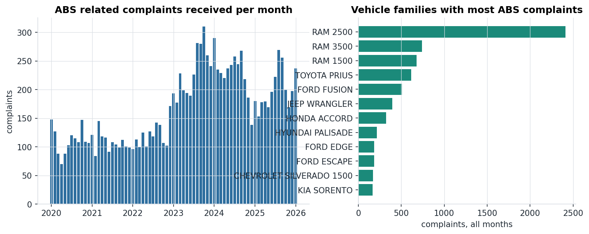
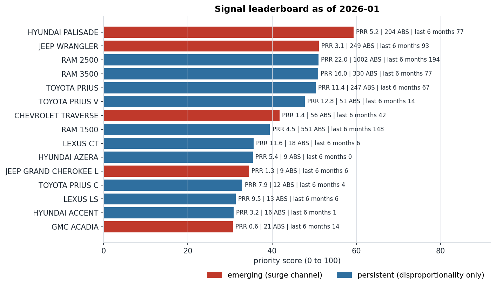
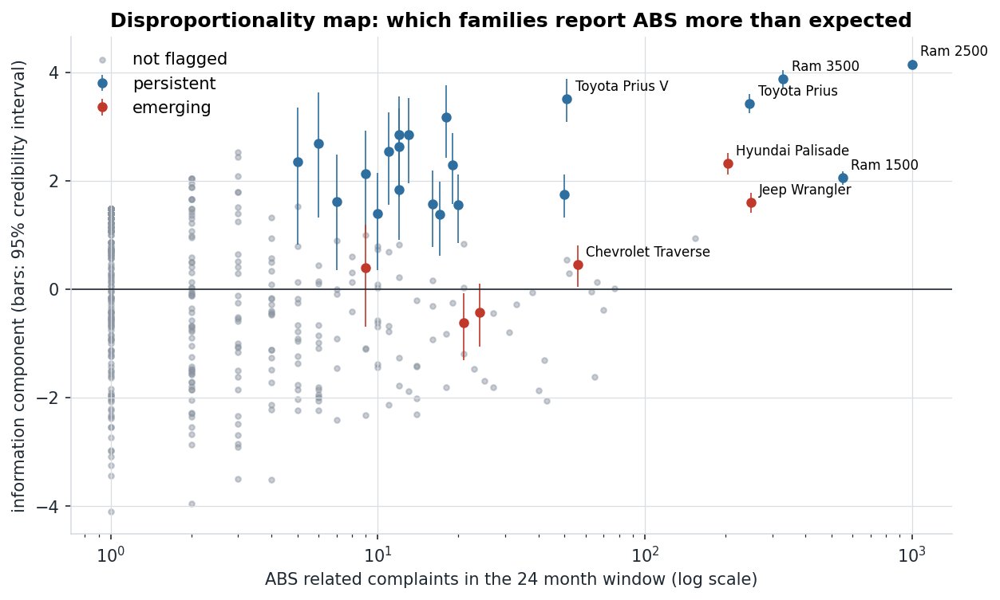
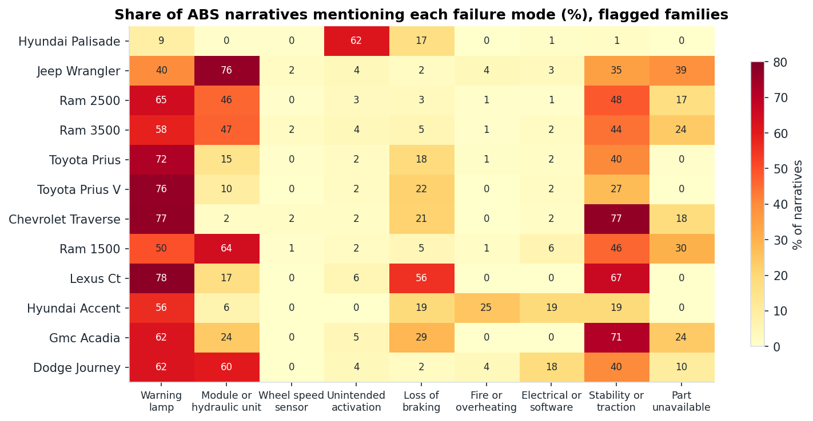
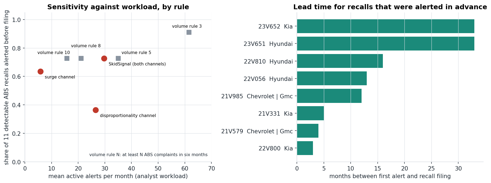
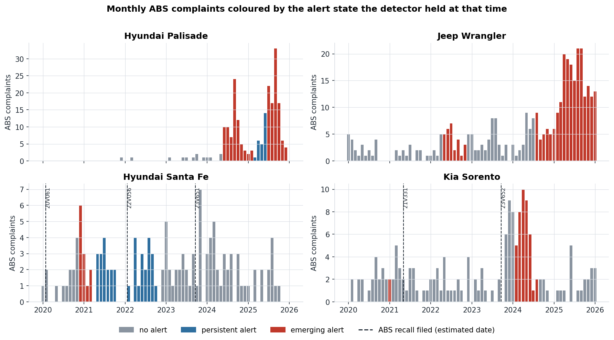
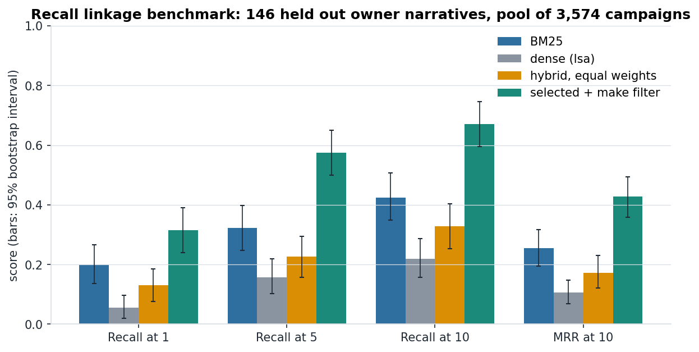

# SkidSignal AI

**Early Detection of Emerging Antilock Brake System Defect Signals through Retrieval Augmented Generation over Public Vehicle Safety Records**

SkidSignal AI reads the public complaint and recall files of the United States National Highway Traffic Safety Administration (NHTSA), finds vehicle families whose antilock brake system (ABS) complaints are unusually prominent or rising, and writes a cited analyst brief for each one. Every number in a brief is computed by a statistical engine, every quoted record carries a citation key, and every sentence is checked by guardrails before release.



## Project brief

An antilock brake system keeps the wheels turning during a hard stop so that the driver can still steer. On a modern vehicle the same sensors, valves and pump also serve traction control, electronic stability control and automatic emergency braking, which means one failed ABS module can silently remove several safety functions at once. When that hardware fails across a vehicle population, the earliest public evidence is almost always the same: owners start writing to NHTSA. Those reports arrive months or years before a recall, but they arrive as free text, mixed in with hundreds of thousands of complaints about everything else, filed against inconsistent component codes and written in the language of drivers, not engineers.

That creates a triage problem for anyone whose job depends on seeing a defect trend early: safety regulators, manufacturer quality teams, warranty and reserving analysts, fleet operators, insurers and consumer advocates. A human analyst cannot read every narrative, and simple counting is misleading because popular vehicles generate more complaints of every kind. The methods that solve this in drug safety, where regulators mine spontaneous adverse event reports, are well established but rarely applied to vehicle data in a transparent and reproducible way. Large language models add a second risk. They write fluent summaries, but an ungrounded summary of a safety signal that invents a number or declares a defect "confirmed" is worse than no summary at all.

SkidSignal AI addresses both halves of the problem. A surveillance engine replays the complaint database month by month and raises a signal through two independent channels: disproportionality (ABS issues make up an unusually large share of a family’s complaints) and surge (ABS complaints are rising faster than the family’s own history predicts, after false discovery control). A retrieval layer over 51,523 chunks of complaint, recall documents and engineering reference notes then assembles an evidence pack that only contains records dated on or before the signal date. A writer turns the pack into a brief, and a guardrail layer rejects any draft with an invalid citation, an uncited claim, a number that is not in the evidence, or overstated language.

The project is deliberately honest about what works. It is tested against real recalls, compared with a naive rule that any analyst could run in a spreadsheet, and its retrieval design was decided by a benchmark in which the simpler method won. The results below include the places where the sophisticated approach did not beat the simple one, because knowing that is part of the value.

## At a glance

<table>
<tr><th>Item</th><th>Value</th></tr>
<tr><td>Raw complaint rows processed</td><td>545,345 component rows, collapsing to 379,221 complaints</td></tr>
<tr><td>Period covered</td><td>1 January 2020 to 19 February 2026</td></tr>
<tr><td>Vehicle families monitored</td><td>2,937</td></tr>
<tr><td>ABS related complaints identified</td><td>12,370, of which 639 involve a crash, fire, injury or death</td></tr>
<tr><td>Recall document rows processed</td><td>216,260 rows, rolling up to 3,574 campaigns, 44 of them ABS related</td></tr>
<tr><td>Knowledge base</td><td>45,739 documents in 51,523 retrieval chunks</td></tr>
<tr><td>Families flagged in the latest month (January 2026)</td><td>27 (6 emerging, 21 persistent)</td></tr>
<tr><td>Detectable ABS recalls alerted before filing</td><td>8 of 11, median lead 12.5 months</td></tr>
<tr><td>Guardrail mutation tests</td><td>108 injected faults, all caught</td></tr>
<tr><td>Automated tests</td><td>29, all passing</td></tr>
<tr><td>Full pipeline run time</td><td>About 70 seconds on one CPU core</td></tr>
</table>

## Knowledge base

All records come from the official NHTSA Office of Defects Investigation flat files. The exact sources, field layouts and snapshot details are in the [data card](docs/DATA_CARD.md).

<table>
<tr><th>Source</th><th>Documents</th><th>Role</th></tr>
<tr><td>Owner complaints in the braking domain</td><td>42,139</td><td>What drivers experienced. Cited as C plus the ODI number.</td></tr>
<tr><td>Recall campaigns, all components</td><td>3,574</td><td>What manufacturers have already admitted and fixed. Cited as R plus the campaign number.</td></tr>
<tr><td>Engineering and regulatory reference notes</td><td>26</td><td>Original notes on ABS operation, failure modes, United States brake regulation and the statistics used. Cited as K plus the note name.</td></tr>
<tr><td>Investigations and manufacturer communications</td><td>optional</td><td>Parsers and loaders are included. These files were not part of the reference run.</td></tr>
</table>

The full complaint table (379,221 complaints across every component) is also retained without narratives, because the signal statistics need the whole database as a background, not only the brake complaints.

Three processing decisions matter for the numbers that follow:

* **One row per complaint.** NHTSA publishes one row per complaint and component, so a narrative filed against five components would otherwise be counted five times. Rows are collapsed and 2,242 exact duplicate submissions are removed.
* **ABS is identified by language as well as by code.** Only 127 of the 12,370 ABS complaints could be found from the component code alone. The rest are filed under generic codes such as service brakes or electrical system and are recognised by an auditable lexicon in `config/abs_taxonomy.yaml`.
* **Personal fields are never loaded.** City, partial vehicle identification number, dealer details and operator name are dropped at the parser.



## How a signal is detected

For every vehicle family and every month the engine builds a two by two table (this family against all others, ABS complaints against all other complaints) over a trailing 24 month window, and then applies two channels.

<table>
<tr><th>Channel</th><th>Question it answers</th><th>Criteria</th></tr>
<tr><td>Disproportionality</td><td>Are ABS problems an unusually large share of this family’s complaints?</td><td>At least 5 ABS complaints, proportional reporting ratio of 2 or more, chi square of 4 or more, and a positive lower credibility bound on the information component (IC025)</td></tr>
<tr><td>Surge</td><td>Are ABS complaints rising faster than this family’s own history predicts?</td><td>At least 5 ABS complaints in the last 6 months and a Poisson tail probability that stays below 0.05 after Benjamin-Hochberg adjustment across all families, with the expectation rescaled for database wide reporting trends</td></tr>
</table>

A family with an active surge channel is placed on the **emerging** tier. A family that is only disproportionate is **persistent**. A CUSUM chart is computed alongside as a check for sustained shifts, and a transparent priority score from 0 to 100 (weights in `config/settings.yaml`) orders the analyst queue. Because everything is computed from a vehicle by month panel, any past month can be replayed using only the complaints NHTSA had received by then.

## Findings

### What the detector is flagging now

As of January 2026, 27 of 2,937 vehicle families are flagged.



<table>
<tr><th>Family</th><th>Tier</th><th>ABS share of complaints</th><th>PRR (95% interval)</th><th>Last 6 months, observed against expected</th><th>What owners describe</th></tr>
<tr><td>Hyundai Palisade</td><td>Emerging</td><td>204 of 1,122 (18.2%)</td><td>5.19 (4.57 to 5.90)</td><td>77 against 44.9</td><td>ABS activation without demand at low speed (61.8% of narratives), mostly model years 2024 and 2025, 9 crashes</td></tr>
<tr><td>Jeep Wrangler</td><td>Emerging</td><td>249 of 2,260 (11.0%)</td><td>3.15 (2.79 to 3.55)</td><td>93 against 55.2</td><td>ABS module or hydraulic unit failure (76.3%), repair part unavailable (39.0%), concentrated in model years 2015 and 2016</td></tr>
<tr><td>Ram 2500</td><td>Persistent</td><td>1,002 of 1,550 (64.6%)</td><td>22.00 (20.98 to 23.08)</td><td>194 against 285.9</td><td>Warning lamps (64.9%), module failure (46.2%), part unavailable (17.2%), 810 complaints from model year 2018 alone</td></tr>
<tr><td>Toyota Prius</td><td>Persistent</td><td>247 of 624 (39.6%)</td><td>11.44 (10.35 to 12.66)</td><td>67 against 63.7</td><td>Warning lamps (72.1%) with loss of braking reports (18.2%), spread across model years 2010 to 2015</td></tr>
<tr><td>Chevrolet Traverse</td><td>Emerging</td><td>56 of 1,128 (5.0%)</td><td>1.38 (1.06 to 1.78)</td><td>42 against 5.0</td><td>ABS warning lamp (76.8%) and stability control affected (76.8%), 4 of 56 complaints from model year 2025</td></tr>
</table>

The database wide ABS share in the same window is 3.6 percent. Four observations stand out for a business reader.

* **The largest signal is not the most urgent one.** Ram 2500 has by far the strongest disproportionality in the database, yet its recent rate is below its own history. It is a large, known, slowly declining problem. The priority score puts Hyundai Palisade above it because the Palisade combines disproportionality with a statistically significant rise.
* **The Palisade pattern is specific and recent.** Almost two thirds of its ABS narratives describe the pedal pulsing and the vehicle rolling further than expected at low speed on dry roads, the complaints concentrate in the two newest model years, and no ABS recall for the family appears in the recall file used here.
* **Parts availability is a signal in its own right.** For the Jeep Wrangler, 39.0 percent of ABS narratives say the replacement module cannot be obtained. These are mostly vehicles around ten years old whose owners report that a failed module cannot be replaced, which is a different risk from a new defect and calls for a different response.
* **Two channels see different things.** Chevrolet Traverse and GMC Acadia would both be missed by a disproportionality screen, because ABS is a small share of their overall complaint mix. The surge channel catches them: the Traverse went from an expected 5.0 ABS complaints to 42 in six months, almost all from a single new model year.



### What owners are describing

Each ABS narrative is tagged against nine failure modes. The heatmap shows how different the problem is from one family to the next, which is exactly what an analyst needs to know before reading individual reports.



Unsupervised clustering of the 12,274 indexed ABS narratives was also run as a discovery aid. It recovered some real themes, including a distinct Toyota hybrid brake booster and actuator cluster (796 narratives) and a Ram truck cluster tied to traction and cruise control (2,562 narratives). It also showed its limits: silhouette scores were low (0.11 at the selected six clusters) and one cluster simply captured the writing style of hotlines transcripts (“the contact state”). For that reason the briefs rely on the auditable taxonomy, and the clusters are reported only as supporting analysis in `reports/failure_clusters.csv`.

### Does it see recalls coming

The backtest replays 62 months (December 2020 to January 2026). An alert is the first month a family reaches either tier. Alerts are compared with ABS related vehicle recall campaigns from the 2020 to 2024 recall file. Of 38 such campaigns, 27 fall inside the evaluation period with affected families present in the complaint data, and only 11 of those had at least five ABS complaints before the recall was filed. The other 16 could not have been found by any complaint based method, which is an important finding in itself: most ABS recalls in this period, especially for heavy trucks, buses and motorcycles, were not preceded by a visible complaint trail.



<table>
<tr><th>Rule</th><th>Detectable recalls alerted in advance</th><th>Median lead</th><th>Mean active alerts per month</th><th>Alerts followed by an ABS recall within 24 months</th></tr>
<tr><td>SkidSignal, both channels</td><td>8 of 11</td><td>12.5 months</td><td>29.7</td><td>11 of 59</td></tr>
<tr><td>Surge channel alone</td><td>7 of 11</td><td>7.0 months</td><td>5.8</td><td>8 of 26</td></tr>
<tr><td>Disproportionality channel alone</td><td>4 of 11</td><td>14.5 months</td><td>26.5</td><td>6 of 44</td></tr>
<tr><td>Naive rule: 3 or more ABS complaints in six months</td><td>10 of 11</td><td>12.5 months</td><td>61.6</td><td>14 of 118</td></tr>
<tr><td>Naive rule: 5 or more</td><td>8 of 11</td><td>10.5 months</td><td>35.0</td><td>11 of 70</td></tr>
<tr><td>Naive rule: 10 or more</td><td>8 of 11</td><td>9.0 months</td><td>15.8</td><td>7 of 32</td></tr>
</table>

The last column only counts alerts raised early enough for the full 24 month horizon to be observed.

How to read this honestly:

* **The surge channel is the efficient triage queue.** It alerted on 7 of 11 detectable recalls while keeping fewer than six families active in a typical month, and 8 of its 26 alerts (31 percent) were followed by an ABS recall. No naive threshold reaches that combination.
* **A simple volume rule is a strong competitor on raw sensitivity.** Ten or more ABS complaints in six months matches the combined detector at 8 of 11 with about half the active alerts. The combined detector’s advantages are a longer median lead (12.5 months against 9.0) and the ability to rank and explain, not a higher hit rate.
* **Disproportionality alone is not enough.** It missed four recalls for Kia and General Motors families whose ABS complaints were masked by a much larger volume of unrelated complaints. At the time of those recalls the affected Kia families had proportional reporting ratios between 0.34 and 1.36. This is why the surge channel is independent.
* **An alert without a recall is not a false alarm.** Ram 2500 has been on alert since the first replayed month and has no ABS vehicle recall in the file. Those alerts are the analyst work queue.
* **The evidence base is small.** Eleven recalls cannot separate methods with statistical confidence. Recall dates are estimated from campaign numbers in this build. The two 33 month leads belong to the 2023 Hyundai and Kia ABS module fire campaigns, whose families were already on alert around earlier campaigns in the same series, so they should not be read as a clean prediction. The full iteration log is in [docs/EVALUATION.md](docs/EVALUATION.md).



### Retrieval quality

Retrieval was evaluated on an organic benchmark that needs no manual labels. Owners sometimes cite an NHTSA campaign number in their narrative. Each citation is a relevance label written by the complainant. The task is to take the narrative with the campaign number masked and find the cited campaign among all 3,574 campaigns. Campaigns were split so that fusion weights were chosen on 87 development queries and results are reported on 146 held out queries.



<table>
<tr><th>Method</th><th>Recall at 1</th><th>Recall at 5</th><th>Recall at 10</th><th>MRR at 10</th></tr>
<tr><td>BM25</td><td>0.199</td><td>0.322</td><td>0.425</td><td>0.255</td></tr>
<tr><td>Dense (offline LSA vectors)</td><td>0.055</td><td>0.158</td><td>0.219</td><td>0.105</td></tr>
<tr><td>Hybrid, equal weights</td><td>0.130</td><td>0.226</td><td>0.329</td><td>0.173</td></tr>
<tr><td>Selected configuration with make filter</td><td>0.315</td><td>0.575</td><td>0.671</td><td>0.427</td></tr>
</table>

Two decisions followed from the measurement, not from fashion.

* **Lexical retrieval is the default.** With the offline LSA encoder, adding dense scores made ranking worse (BM25 minus equal hybrid, MRR difference 0.082, 95% bootstrap interval 0.030 to 0.136). The development split selected a dense weight of zero, so the shipped configuration ranks with BM25 and uses the dense vectors for result diversification and clustering. A transformer encoder backend is implemented and switchable in the settings, but it was not benchmarked in this build and its weights must be selected again before use.
* **Metadata filtering is worth more than the ranking model.** Restricting the pool to campaigns for the complainant’s make lifted recall at 10 from 0.425 to 0.671 (MRR difference 0.172, interval 0.129 to 0.219). Every brief therefore retrieves with vehicle, source and date filters.

One engineering detail deserves mention. The stock English stop word list in scikit learn removes the word "fire" along with "system", "front" and "back". On a brake safety corpus that silently destroys the most important queries, so the project ships its own short list and a test that guards it.

### Guardrails

<table>
<tr><th>Check</th><th>What it enforces</th><th>Result</th></tr>
<tr><td>Citation validity</td><td>Every citation key exists in the evidence pack</td><td>27 of 27 fabricated citations caught</td></tr>
<tr><td>Citation coverage</td><td>At least 90 percent of evidence bearing sentences carry a citation</td><td>27 of 27 stripped narratives caught</td></tr>
<tr><td>Numeric fidelity</td><td>Every number already appears in the computed facts or a cited record</td><td>27 of 27 altered numbers caught</td></tr>
<tr><td>Calibrated language</td><td>No wording that asserts a confirmed defect</td><td>27 of 27 overstated sentences caught</td></tr>
<tr><td>Clean briefs</td><td>Unmodified briefs for all 27 flagged families</td><td>27 of 27 pass</td></tr>
</table>

These are mutation tests of the checks themselves. They show the guardrails catch the faults they were designed for. They are not a measure of language model quality, which was not run in this build (see below).

## Example brief

An excerpt from the brief for the highest priority signal, lightly condensed and with dates written out. The complete file is [docs/examples/brief_hyundai_palisade.md](docs/examples/brief_hyundai_palisade.md), and a second example for a persistent signal is [docs/examples/brief_ram_2500.md](docs/examples/brief_ram_2500.md).

> **Signal summary.** HYUNDAI PALISADE is on the emerging tier as of January 2026 with a priority score of 59.3, rank 1 of 27 flagged families [S]. In the 24 month window, 204 of its 1,122 complaints were ABS related, a share of 18.2 percent against 3.6 percent across all vehicles [S]. The proportional reporting ratio is 5.19 with a 95 percent interval of 4.57 to 5.90, and the lower credibility bound of the information component (IC025) is 2.11 [S]. The most recent 6 months brought 77 ABS complaints against 44.9 expected from the earlier rate, a rate ratio of 1.71 that stays significant after false discovery control [S].
>
> **Failure mode profile.** The most frequent failure mode tag is "ABS activation without demand or abnormal pedal pulsation" (126 narratives, 61.8 percent) [S]. An owner report for a 2024 HYUNDAI PALISADE states: "The Palisade has been intermittently acting up approaching a stop and the pedal pulsates and pedal travel is much longer, stopping distance is lengthened" [C:11674735].
>
> **Assessment.** The evidence is consistent with a growing ABS related problem that is also unusually prominent in this family’s complaint mix [S]. This is a statistical signal built from unverified owner reports and it does not establish that a defect exists [K:surveillance_methods.known_limits_of_complaint_based_surveillance].

Each brief also contains the full statistics table, the failure mode table, the cited complaint and recall records, recommended analyst actions and a fixed limitations section.

## Repository layout

```
config/            settings.yaml (every threshold) and abs_taxonomy.yaml (lexicon)
knowledge/         original reference notes indexed as citable documents
src/skidsignal/
  ingestion/       downloader and flat file parsers
  processing/      normalisation, taxonomy tagging, knowledge base builder
  index/           BM25, embeddings, hybrid index with filters and diversification
  signals/         disproportionality, surge test, CUSUM, detector, backtest
  analysis/        failure mode profiles and narrative clustering
  rag/             evidence pack, prompts, writers, guardrails, question answering
  evaluation/      retrieval benchmark and guardrail mutation tests
  viz/             figures
  api/             FastAPI service
  engine.py        one object that serves the CLI and the API
  cli.py           command line interface
tests/             29 tests, including an end to end run on the bundled sample
data/sample/       small real sample (2,800 complaints, 202 campaigns) for tests and demos
reports/           signal table, backtest, benchmark and guardrail results, ten briefs
docs/              data card, evaluation notes, figures, example briefs
```

## Running the project

Python 3.10 or newer is required.

```
make install        # install the package and test tools
make test           # run the 29 tests
make sample         # run the whole pipeline on the bundled sample in a few seconds
```

To reproduce the full results:

```
make download       # fetch the official NHTSA flat files into data/raw
make all            # prepare, index, signals, backtest, cluster, evaluate, briefs, figures
```

Individual steps and queries:

```
make signals
make brief VEHICLE="RAM 2500"
make ask Q="Which vehicles report ABS activation at low speed on dry roads?"
make api            # then open http://localhost:8000/docs
```

<table>
<tr><th>Endpoint</th><th>Purpose</th></tr>
<tr><td>GET /health</td><td>Index size, latest complete month, active writer</td></tr>
<tr><td>GET /signals</td><td>Ranked signal table for the latest month or any past month</td></tr>
<tr><td>POST /search</td><td>Retrieval with source, make, family and date filters</td></tr>
<tr><td>POST /brief</td><td>Full brief with narrative, guardrail report and evidence pack</td></tr>
<tr><td>POST /ask</td><td>Grounded question answering with citations</td></tr>
</table>

### Using a language model writer

The default writer is extractive and deterministic, so the project runs with no network access and no credentials. To have Claude write the narrative sections, run `make install_llm`, set `llm.provider` to `anthropic` in `config/settings.yaml`, and export `ANTHROPIC_API_KEY`. The model receives only the evidence pack and a strict prompt, numbers and tables are still rendered by code, and the draft must pass the same guardrails. A draft that fails is sent back once with the list of issues. If it fails again, the extractive narrative is used and the brief records that fallback happened.

## What was and was not run in the reference build

<table>
<tr><th>Component</th><th>Status</th></tr>
<tr><td>Complaint and recall document parsing, signals, backtest, index, benchmark, briefs, figures, API, tests</td><td>Run on real NHTSA data and verified</td></tr>
<tr><td>Language model writer (Anthropic)</td><td>Implemented. The draft, repair and fallback logic is covered by tests with a stand in model. No live model call was made, so no claim is made about generated text quality.</td></tr>
<tr><td>Transformer embedding backend and cross encoder reranker</td><td>Implemented behind settings, not run</td></tr>
<tr><td>Downloader, recall flat file, investigations and manufacturer communications parsers</td><td>Written to the published NHTSA layouts, not run against live files. The reference data came from a public mirror of the official files (see the data card).</td></tr>
</table>

## Limitations and responsible use

* A complaint is an unverified allegation. Complaint counts reflect reporting behaviour, publicity and fleet size as well as failure rates. A signal is a reason for an engineer to read the evidence. It is never a finding that a defect exists.
* Signals are computed per vehicle family across all model years. A problem confined to one model year can be diluted, and a family level alert may concern a different ABS issue from a later recall.
* The recall document file used here covers campaigns from 2020 to 2024, has no filing dates (they are estimated from campaign numbers to within a few weeks), and files Ram replacement part campaigns under an equipment brand. "No recall on file" means no ABS vehicle campaign for that family in this file.
* The backtest rests on 11 detectable recalls and one country’s data, and the detector design was revised after the first backtest.
* The taxonomy is a lexicon. It will miss unusual wording and will sometimes tag a narrative that mentions a term in passing.

## Roadmap

* Load the recall flat file for exact dates, units affected and component names, then repeat the backtest.
* Add investigations and manufacturer communications to the knowledge base and to the backtest as earlier ground truth events.
* Benchmark a transformer encoder and a cross encoder reranker on the recall linkage task.
* Extend history to 1995 for a larger recall sample, and add model year band signals.
* Evaluate the language model writer against the extractive baseline with human review.
* Add United Kingdom recall and inspection data as a second jurisdiction.

## Licence and data

The source code and reference notes are released under the MIT licence. Complaint and recall records are published by NHTSA as open government data. See the [data card](docs/DATA_CARD.md) for sources and handling.
